[>>> Github 传送门<<<](https://github.com/Leager-zju/GAMES101)

<!--more-->

## 环境搭建

使用平台：**Windows** + Vscode + MSYS2 + MinGW

### Eigen 库安装 & 编译

进入[下载地址](https://gitlab.com/libeigen/eigen/-/releases/)进行下载并解压。

```bash
cd /your/path/to/Eigen
mkdir build && cd build
cmake -G "Unix Makefiles" .. ## windows 下默认生成 ninja，需要改为生成 makefile
make install -j8
```

然后会自动在 `C:/Program Files(x86)` 下生成一个名为 `eigen3` 的文件夹。也可以移到自己喜欢的地方，记为 `/your/path/to/eigen3`。

### opencv 库安装 & 编译

进入[下载地址](https://sourceforge.net/projects/opencvlibrary/files/opencv-win/)进行下载并双击 .exe 文件解压。

```bash
cd /your/path/to/opencv
cd sources
mkdir build && cd build
cmake -G "Unix Makefiles" -D WITH_OPENGL=ON -D ENABLE_CXX11=ON -D WITH_IPP=OFF -D ENABLE_PRECOMPILED_HEADERS=OFF ..
```

接下来用管理员权限运行 `make -j8 && make install -j8`。

会在 `sources/build/` 目录下生成一个名为 `install` 的目录，这就是我们所需要的目录，其他都可以忽略，记为 `your/path/to/opencv`

### 编译

CMakelists 参见相应分支。

❗ 注意：需要将 `your/path/to/opencv/x64/mingw/bin` 加入系统变量 PATH，否则链接阶段会找不到对应的动态库。

## Assignment1 透视投影

第一个作业要求实现透视投影的 MVP 三个矩阵。

### 旋转矩阵(Model)

这里要求实现按 $\mathbf{z}$ 轴旋转的矩阵。注意 `get_model_matrix(float rotation_angle)` 的参数是角度制，而使用 C++ 函数 `sin()`/`cos()` 时要转为弧度制。

实现如下：

```cpp
// 角度转弧度
float angleToRadians(float angle) { return MY_PI*angle/180; }

// Create the model matrix for rotating the triangle around the Z axis.
// Then return it.
Eigen::Matrix4f get_model_matrix(float rotation_angle)
{
    // transform angle to radians
    float cosValue = cos(angleToRadians(rotation_angle));
    float sinValue = sin(angleToRadians(rotation_angle));
    Eigen::Matrix4f rotate;
    rotate << cosValue, -sinValue, 0, 0,
              sinValue, cosValue,  0, 0,
              0,        0,         1, 0,
              0,        0,         0, 1;
    return rotate;
}
```

### 平移矩阵(View)

这里其实就是将世界中所有物体同时平移，使得相机位于世界坐标的原点。`get_view_matrix(Eigen::Vector3f eye_pos)` 的参数是相机的初始位置。

实现如下

```cpp
Eigen::Matrix4f get_view_matrix(Eigen::Vector3f eye_pos)
{
    Eigen::Matrix4f translate;
    translate << 1, 0, 0, -eye_pos[0],
                 0, 1, 0, -eye_pos[1],
                 0, 0, 1, -eye_pos[2],
                 0, 0, 0, 1;
    return translate;
}
```

### 投影矩阵(Projection)

这里需要我们实现透视投影矩阵，也是本次任务的难点所在。虽然课程中已经用数学方法推导出了矩阵，但这里还有一些不一样的地方：课程中的推导采用右手系，即相机在原点往 $\mathbf{z}$ 轴负方向看，此时矩阵中的 $n$ 和 $f$ 都应为负值。

而通过观察 `main()` 我们发现，这里 `get_projection_matrix(float eye_fov, float aspect_ratio, float zNear, float zFar)` 的两个参数 `zNear`/`zFar` 传入的都是正数。如果直接用这两个作为 $n$ 和 $f$，会发现结果出现三角形上下颠倒的问题（准确来说是与预期值在 $\mathbf{z}$ 轴上偏移了 180°）。

导致这一结果的原因在于，我们在推导过程中认为可视空间内某一点 $(x, y, z)$ 与近平面上的点 $(x', y', n)$ 应当存在这样一个关系

$$
x' = \frac{n}{z}x
$$

一旦 $n$ 和 $z$ 符号相反，就会出现 $x'$ 的值也相反，同理 $y'$ 的值也反了，那不就使得观测结果不符合预期了么。

我的做法是：依然采用**右手系**，不同的是需要将这两个参数理解为近/远平面离原点的距离，$n$ 和 $f$ 各取相应的负值，这样就能解决这一问题了。

```cpp
Eigen::Matrix4f get_projection_matrix(float eye_fov, float aspect_ratio,
                                      float zNear, float zFar)
{
    // eye_fov: viewing angle in the range of [-eye_fov, eye_fov]
    // aspect_ratio: the height:width of viewing plane
    Eigen::Matrix4f squish;
    Eigen::Matrix4f translation;
    Eigen::Matrix4f scale;

    float n = -zNear;
    float f = -zFar;

    squish << n, 0, 0,   0,
              0, n, 0,   0,
              0, 0, n+f, -n*f,
              0, 0, 1,   0;

    float top = abs(n)*tan(angleToRadians(eye_fov/2));
    float bottom = -top;

    float right = top*aspect_ratio;
    float left = -right;

    translation << 1, 0, 0, -(left+right)/2,
                   0, 1, 0, -(top+bottom)/2,
                   0, 0, 1, -(n+f)/2,
                   0, 0, 0, 1;

    scale << 2/(right-left), 0,              0,       0,
             0,              2/(top-bottom), 0,       0,
             0,              0,              2/(n-f), 0,
             0,              0,              0,       1;

    return scale*translation*squish;
}
```

### BONUS: 按任意轴 axis 旋转

按照课程推导结果代入即可

```cpp
Eigen::Matrix4f get_rotation(Vector3f axis, float angle)
{
    Eigen::Matrix4f K = Eigen::Matrix4f::Identity();
    float sinValue = sin(angleToRadians(angle));
    float cosValue = cos(angleToRadians(angle));
    float kx = axis[0];
    float ky = axis[1];
    float kz = axis[2];
    K << 0,   -kz, ky,
         kz,  0,   -kx,
         -ky, kx, 0;
    return Eigen::Matrix4f::Identity() + sinValue*K + (1-cosValue)*K*K;
}
```

### 总结

第一个作业难度甚至可以说低。唯一的难点在于对 `zNear` 和 `zFar` 的理解是否有误，这一点当时卡了我一定时间，解决该问题的同时对整个透视投影的理解也加深了许多。

## Assignment2 光栅化

第二个作业要求利用 Z-Buffer 算法实现光栅化。

### 判断是否在三角形内

经过透视投影后，我们知道了三角形三个顶点在屏幕空间中的坐标。那么对于屏幕空间内的 pixel，可以利用重心坐标来判断是否在三角形内，如果重心坐标的三个值均在 $[0, 1]$ 之间，那么就认为这个 pixel 在三角形内。

```cpp
static bool insideTriangle(float x, float y, const Vector3f* _v)
{
    auto [alpha, beta, gamma] = computeBarycentric2D(x, y, _v);
    return alpha >= 0 && beta >= 0 && gamma >= 0;
}
```

`computeBarycentric2D()` 是课程框架为我们实现好的求重心坐标的函数，直接用即可。

### 对三角形进行光栅化

要实现的函数为 `rasterize_triangle()`。为了减少开销，我们只需要在三角形的 bounding box 内遍历 pixel 即可。

> 可能存在的 corner case 是三角形顶点坐标不在可视空间内，所以需要对 bounding box 的边界进行特殊处理。

如果一个 pixel 在三角形内，那么我们需要利用重心坐标求出对应的深度值，并判断是否需要用当前 RGB 覆盖原有的。因为这里是右手系，所以求出的点的 $\mathbf{z}$ 值都是负数，这个值越大，说明离原点（相机）越近，就是要覆盖的。

```cpp
void rst::rasterizer::rasterize_triangle(const Triangle& t)
{
    // 求解 bounding box（略）

    // 遍历 pixel
    for (int x = min_x; x <= max_x; x++) {
        for (int y = min_y; y <= max_y; y++) {
            int pixel_index = get_index(x, y);
            // pixel center 坐标值
            float sampleX = x + 0.5;
            float sampleY = y + 0.5;
            if (!insideTriangle(sampleX, sampleY, t.v)) continue;

            auto[alpha, beta, gamma] = computeBarycentric2D(sampleY, sampleY, t.v);

            // 下面这段代码是什么意思呢？
            float w_reciprocal = 1.0/(alpha / v[0].w() + beta / v[1].w() + gamma / v[2].w());
            float z_interpolated = alpha * v[0].z() / v[0].w() + beta * v[1].z() / v[1].w() + gamma * v[2].z() / v[2].w();
            z_interpolated *= w_reciprocal;

            if (isinf(depth_buf[pixel_index])  || z_interpolated > depth_buf[pixel_index]) {
                depth_buf[pixel_index] = z_interpolated;
                set_pixel({x, y, 0}, t.getColor());
            }
        }
    }
}
```

注意到框架让我们用注释的方法求深度值，但提供的代码有些莫名其妙。查阅资料发现，可视空间中的三角形经过透视投影变换到了屏幕空间后，同一点 $P$ 的重心坐标会发生变化，所以不能直接用屏幕空间中的重心坐标来插值三角形的在可视空间中的真实属性，而需要用一定手段进行**校正**。

🙋‍♂️ 看到这里需要特别说明一下，下面所有在**屏幕空间**中（求出）的值都会加上 $\prime$，如果没有，则表明这个值是属于**可视空间/真实空间**的。

网上关于这个的资料已经非常详细了，我直接贴结论：

$$
\frac{1}{z_P} = \frac{\alpha'}{z_A}+\frac{\beta'}{z_B}+\frac{\gamma'}{z_C}
$$

> 解释一下，其中 $\alpha', \beta', \gamma'$ 是点 $P$ 在 $\triangle{ABC}$ 中**屏幕空间**下的重心坐标，而 $z_P, z_A, z_B, z_C$ 都是这些点在**可视空间**中的 $\mathbf{z}$ 值。

如果想通过插值求点 $P$ 的属性 $I$，那就用以下公式：

$$
I_P = z_P[\frac{\alpha'}{z_A}I_A + \frac{\beta'}{z_B}I_B + \frac{\gamma'}{z_C}I_C] = \frac{\frac{\alpha'}{z_A}I_A + \frac{\beta'}{z_B}I_B + \frac{\gamma'}{z_C}I_C}{\frac{\alpha'}{z_A}+\frac{\beta'}{z_B}+\frac{\gamma'}{z_C}}
$$

而透视投影矩阵的第四行为 $[0,0,1,0]$，也就是说最后得到的 $\mathbf{w}$ 值自然就存储了顶点的真实深度。这就是为什么框架给的代码用的是齐次坐标 $\mathbf{w}$ 值而不是 $\mathbf{z}$ 值了——屏幕空间中的 $\mathbf{z}$ 值是经过投影变换后的，不是真实深度。

> 至于之前的旋转平移变换，都只是改变绝对位置，相对位置还是不变的，所以不会影响深度，只要看透视投影就行。

那么框架的代码就很容易理解了，`z_interpolated` 并不是真实深度，而是可视空间深度。只不过框架这里存在问题，前面 `v = t.toVector4()` 的时候，函数 `toVector4()` 里对 $\mathbf{w}$ 的赋值竟然直接赋了 `1`，这就导致所谓的校正仍然 fall back 到线性插值。虽然结果看起来没啥问题，但这也是一个值得注意的点。

### BONUS: MSAA

为了实现 MSAA，就不能对于一个 pixel 设置一个 Z Buffer 值了。假设我们用 $n\times n$ 个采样点对同一个 pixel 进行采样，那么就需要对同一个 pixel 设置 $n\times n$ 个 Z Buffer，与等量的 RGB Buffer，这样之后就可以求一个 pixel 内所有采样点的 RGB 平均值来上色。

```cpp
void rst::rasterizer::rasterize_triangle(const Triangle& t)
{
    // 求解 bounding box（略）

    const int sample_count = msaa*msaa;

    for (int x = min_x; x <= max_x; x++) {
        for (int y = min_y; y <= max_y; y++) {
            int pixel_index = get_index(x, y);
            int count = 0;
            for (int i = 0; i < sample_count; i++) {
                float samplePointWidth = 1.0/msaa;
                int col = i%msaa;
                int row = i/msaa;
                // 计算采样点中心坐标
                float sampleX = x + col*samplePointWidth + samplePointWidth/2;
                float sampleY = y + row*samplePointWidth + samplePointWidth/2;

                if (!insideTriangle(sampleX, sampleY, t.v)) continue;

                auto[alpha, beta, gamma] = computeBarycentric2D(sampleX, sampleY, t.v);
                float w_reciprocal = 1.0/(alpha / v[0].w() + beta / v[1].w() + gamma / v[2].w());
                float z_interpolated = alpha * v[0].z() / v[0].w() + beta * v[1].z() / v[1].w() + gamma * v[2].z() / v[2].w();
                z_interpolated *= w_reciprocal;

                if (isinf(sample_depth_buf[pixel_index][i])  || z_interpolated > sample_depth_buf[pixel_index][i]) {
                    sample_depth_buf[pixel_index][i] = z_interpolated;
                    sample_color_buf[pixel_index][i] = t.getColor();
                    count++;
                }
            }
            if (count) {
                // 即上色结果有更新
                Vector3f res = {0.0, 0.0, 0.0};
                for (auto&& color : sample_color_buf[pixel_index]) {
                    res += color;
                }
                set_pixel({x, y, 0}, res/(sample_count));
            }
        }
    }
}
```

### 总结

校正插值是本次作业的难点，需要好好理解推导过程。

输出结果如下：

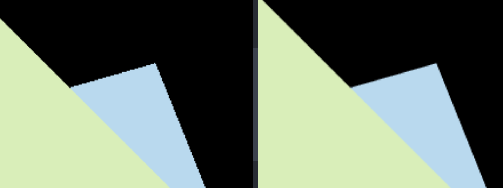

左侧是不用 MSAA 的结果，右侧是使用 4×MSAA 的结果，可以看到锯齿得到了明显改善。

## Assignment3 纹理与插值

第三个作业要求我们实现更多属性的插值，并且将纹理应用到模型上。

### 更多的插值与法线着色

有了作业 2 的前置知识，其实求真实属性已经不是什么难点了，只不过这次 `rasterize_triangle()` 函数中多了一个名为 `view_pos` 的参数，通过阅读 `draw()` 函数我们发现，这正是三角形顶点在可视空间中的坐标，这样一来真实深度就有了，只要在屏幕空间求一遍重心坐标即可。

```cpp
void rst::rasterizer::rasterize_triangle(const Triangle& t, const std::array<Eigen::Vector3f, 3>& view_pos)
{
    // 求解 bounding box（略）

    for (int x = min_x; x <= max_x; x++) {
        for (int y = min_y; y <= max_y; y++) {
            int pixel_index = get_index(x, y);
            float sampleX = x + 0.5;
            float sampleY = y + 0.5;
            if (!insideTriangle(sampleX, sampleY, v)) continue;

            auto[alpha, beta, gamma] = computeBarycentric2D(sampleX, sampleY, v); // Barycentric Coordinates

            float Z = 1.0 / (alpha / v[0].w() + beta / v[1].w() +
                             gamma / v[2].w());  // depth in view space
            float zp =
                alpha * v[0].z() / v[0].w() + beta * v[1].z() / v[1].w() +
                gamma * v[2].z() / v[2].w();  // depth in projection space
            zp *= Z;

            if (isinf(depth_buf[pixel_index]) || zp > depth_buf[pixel_index]) {
                depth_buf[pixel_index] = zp;

                // 各个属性的插值结果
                Vector3f interpolated_color = interpolate(
                    alpha / v[0].w(), beta / v[1].w(), gamma / v[2].w(),
                    t.color[0], t.color[1], t.color[2], 1 / Z);

                Vector3f interpolated_normal = interpolate(
                    alpha / v[0].w(), beta / v[1].w(), gamma / v[2].w(),
                    t.normal[0], t.normal[1], t.normal[2], 1 / Z);

                Vector2f interpolated_texcoords = interpolate(
                    alpha / v[0].w(), beta / v[1].w(), gamma / v[2].w(),
                    t.tex_coords[0], t.tex_coords[1], t.tex_coords[2], 1 / Z);

                Vector3f interpolated_shadingcoords = interpolate(
                    alpha / v[0].w(), beta / v[1].w(), gamma / v[2].w(),
                    view_pos[0], view_pos[1], view_pos[2], 1 / Z);

                // 一个数据结构，传递给 fragment_shader 以求出上色结果
                fragment_shader_payload payload(
                    interpolated_color, interpolated_normal.normalized(),
                    interpolated_texcoords, texture ? &*texture : nullptr);
                payload.view_pos = interpolated_shadingcoords;

                Vector3f pixel_color = fragment_shader(payload);
                set_pixel({x, y}, pixel_color);
            }
        }
    }
}
```

输出结果如下：

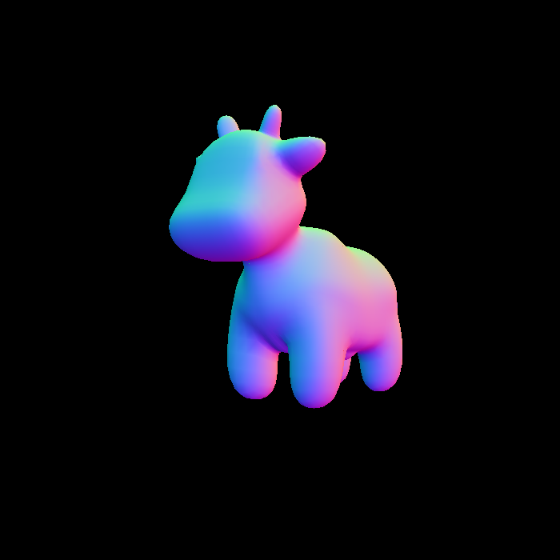

### Blinn Phong 着色

Blinn Phong 模型里面有三个项：漫反射项、高光项、环境光项。这些项的所需参数大部分都在框架中给出，需要我们求的有

- 光线方向 $\mathbf{l}$；
- 观测方向 $\mathbf{v}$；
- 半程向量 $\mathbf{h}$；

注意，结构体 `fragment_shader_payload` 中包含了非常多有用信息，比如

- 着色点真实坐标 `view_pos`；
- 着色点 RGB `color`；
- 着色点法线方向 `normal`；
- 着色点纹理坐标 `tex_coords`；
- 着色点所在模型对应的纹理 `texture`；

那么 $\mathbf{l},\mathbf{v},\mathbf{h}$ 就很好求了，要注意的是公式里的这些变量都是单位向量，要调用 `normalized()` 进行单位化。

```cpp
Eigen::Vector3f phong_fragment_shader(const fragment_shader_payload& payload)
{
    Eigen::Vector3f ka = Eigen::Vector3f(0.005, 0.005, 0.005);
    Eigen::Vector3f kd = payload.color;
    Eigen::Vector3f ks = Eigen::Vector3f(0.7937, 0.7937, 0.7937);

    auto l1 = light{{20, 20, 20}, {500, 500, 500}};
    auto l2 = light{{-20, 20, 0}, {500, 500, 500}};

    std::vector<light> lights = {l1, l2};
    Eigen::Vector3f amb_light_intensity{10, 10, 10};
    Eigen::Vector3f eye_pos{0, 0, 10};

    float p = 150;

    Eigen::Vector3f color = payload.color;
    Eigen::Vector3f point = payload.view_pos;
    Eigen::Vector3f normal = payload.normal;

    Eigen::Vector3f result_color = {0, 0, 0};
    for (auto& light : lights)
    {
        Vector3f l = (light.position - point).normalized();  // 光线方向
        Vector3f v = (eye_pos - point).normalized();         // 观测方向
        Vector3f h = (l + v).normalized();                   // 半程向量
        float r_square = (light.position - point).dot(light.position - point);
        Vector3f light_intensity = light.intensity / r_square;

        Vector3f ambient_item = product(ka, amb_light_intensity); // 环境光项
        Vector3f diffuse_item =
            product(kd, light_intensity) * std::max<float>(0.0, normal.dot(l)); // 漫反射项
        Vector3f specular_item =
            product(ks, light_intensity) *
            std::pow(std::max<float>(0.0, normal.dot(h)), p); // 高光项
        result_color += ambient_item + diffuse_item + specular_item;
    }

    return result_color * 255.f;
}
```

> 这里 `ka`/`kd`/`ks`/`light_intensity` 都是三元向量，分别在 RGB 三个通道上进行乘算，最后的结果也是一个三元向量，那就需要定义一个新的向量乘法，使得 $\text{product}([a_1, a_2, \dots, a_n], [b_1, b_2, \dots, b_n]) = [a1*b_1, a2*b_2,\dots,a_n*b_n]$。

输出结果如下：

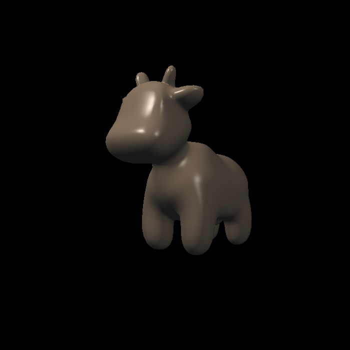

### 纹理着色

这一步是在 Blinn Phong 的基础上用纹理中的 RGB 值代替模型本身 RGB 值，在前面加上以下代码即可。

```cpp
if (payload.texture)
{
    float u = payload.tex_coords.x();
    float v = payload.tex_coords.y();
    return_color = payload.texture->getColorBilinear(u, v);
}
```

输出结果如下：

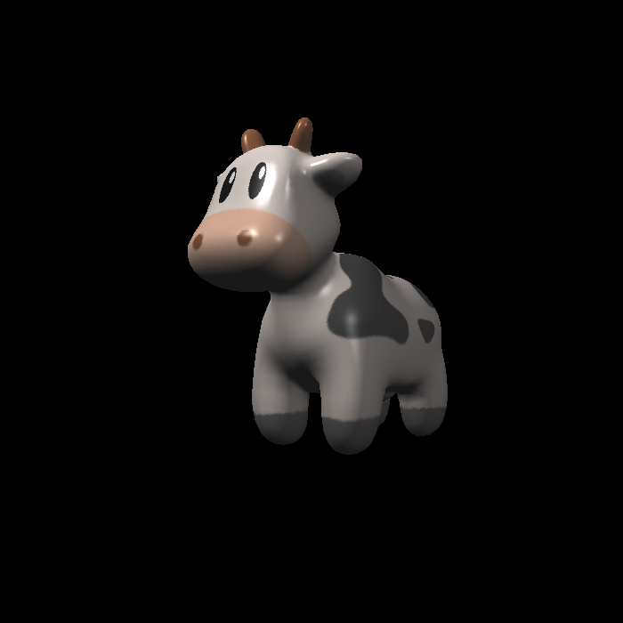

### 凹凸贴图

按照注释实现即可，其中 TBN 矩阵会在后续进行推导。输出结果如下：

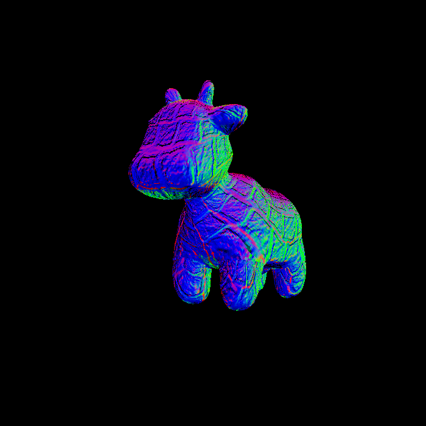

### 位移贴图

依然是按照注释实现。输出结果如下：

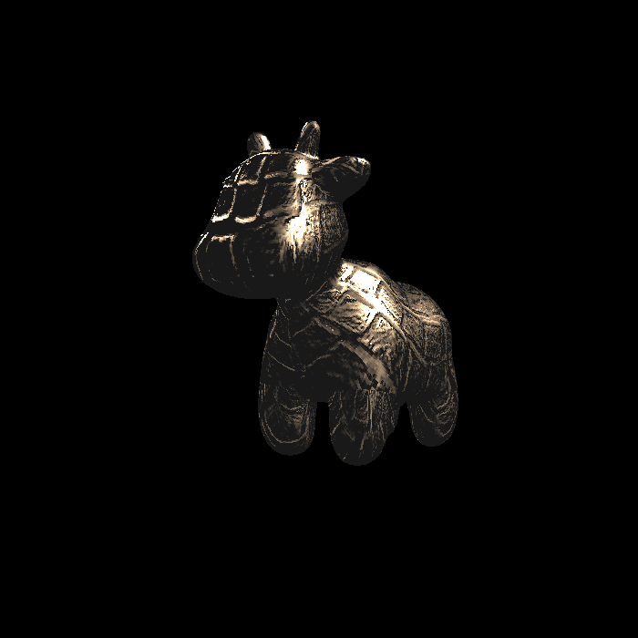

### BONUS: 双线性插值

我们需要在 `Texture.hpp` 里实现函数 `getColorBilinear()`。结合下面这张图，我们可以得出一些思路。

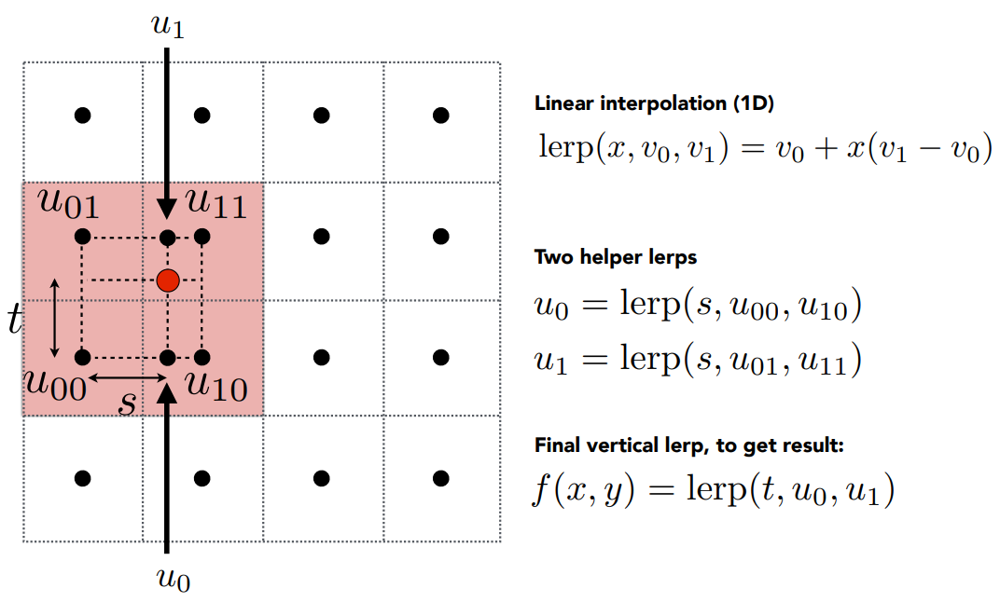

第一步要做的是找出离纹理坐标系上的一点 $(u, v)$ 最近的 4 个 texel，那么就需要根据这个点在当前 texel 的位置进行判断。我们可以计算当前点到左侧 texel 中心在横坐标上的距离（对应公式中的 $s$），如果值大于 1，说明在横向上最近的是右侧 texel，反之是左侧的 texel。我们只需要将当前 $(u, v)$ 定位到 4 个 texel 中左下的那个，就可以很方便地进行计算了。

```cpp
Eigen::Vector3f getColorBilinear(float u, float v)
{
    // 纹理图是一个矩阵，要用行/列的形式访问
    auto u_img = u * width;        // 矩阵列
    auto v_img = (1 - v) * height; // 矩阵行

    float s = u_img-(int)u_img + 0.5;
    float t = v_img-(int)v_img + 0.5;

    if (s > 1) {
        s = s-1;
    } else {
        u_img = u_img-1;
    }
    if (t > 1) {
        t = t-1;
    } else {
        v_img = v_img-1;
    }

    auto u00 = image_data.at<cv::Vec3b>(v_img, u_img);
    auto u10 = image_data.at<cv::Vec3b>(v_img, u_img + 1);
    auto u01 = image_data.at<cv::Vec3b>(v_img + 1, u_img);
    auto u11 = image_data.at<cv::Vec3b>(v_img + 1, u_img + 1);

    auto u0 = u00 + s * (u10 - u00);
    auto u1 = u01 + t * (u11 - u01);

    auto color = u0 + t * (u1 - u0);
    return Eigen::Vector3f(color[0], color[1], color[2]);
}
```

输出结果对比（奶牛鼻子处），右侧是采用双线性插值的结果，可以看到过渡更加平滑。

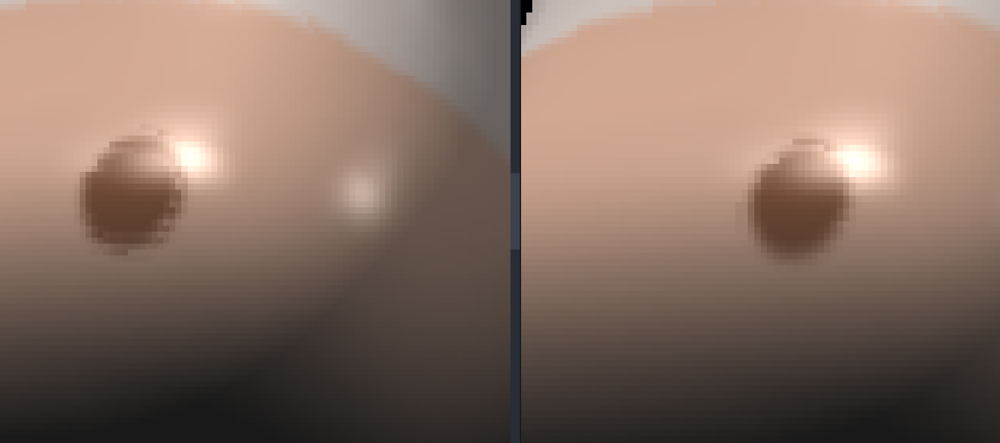

### 总结

框架帮我们实现了 `insideTriangle()` 函数，但可能会出现纹理坐标 $>1$ 的情况，修改为用重心坐标判断就 ok 了。

## Assignment4 贝塞尔曲线

第四个作业要求我们绘制贝塞尔曲线。

### 贝塞尔曲线

课程给的框架中为我们实现了一个静态的贝塞尔曲线绘制函数 `naive_bezier()`，根据 4 个控制点进行绘制。我们需要实现另一个递归的版本。

递归版本的思路是：对于给定控制点集 $C=\{c_1, c_2, \dots, c_n\}$，取所有的相邻的两个控制点 $c_i, c_{i+1}$，找到所有的 $n-1$ 个 $t$ 分点 $c_{i, t} = t*c_i + (1-t)*c_{i+1}$ 加入新的控制点集合 $C' = \{c_{1,t}, c_{2,t}, \dots, c_{n-1, t}\}$ ，并作为递归函数的参数传入。

```cpp
cv::Point2f recursive_bezier(const std::vector<cv::Point2f> &control_points, float t)
{
    if (control_points.size() == 1) {
        return control_points[0];
    }
    std::vector<cv::Point2f> new_control_points;
    for (int i = 0; i < control_points.size()-1; i++) {
        new_control_points.emplace_back(t * control_points[i] + (1-t) * control_points[i+1]);
    }
    return recursive_bezier(new_control_points, t);
}

void bezier(const std::vector<cv::Point2f> &control_points, cv::Mat &window)
{
    for (double t = 0.0; t <= 1.0; t += 0.001)
    {
        cv::Point2f point = recursive_bezier(control_points, t); // 找到 bezier(t) 的点
        // 通道 [1] 是 G 值，[2] 是 R 值
        window.at<cv::Vec3b>(point.y, point.x)[1] = 255;
    }
}
```

> 虽然课程框架只说实现 4 个控制点的版本，但是递归的实现应该能够支持任意数量的控制点。

输出结果如下：

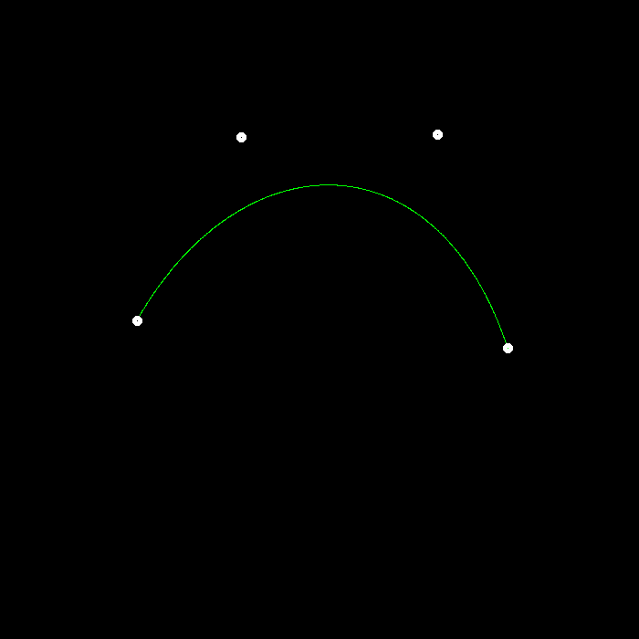

### 反走样

曲线反走样的基本思路就是**加粗**。虽然这里不能用双线性插值，因为最近的 4 个像素点不一定都有颜色，但是也值得参考。我们可以找最近的四个 pixel，根据 `bezier(t)` 与这些 pixels 中心点的距离来为其赋予相应的 G 值。

对于一个点来说，其与最近 4 个 pixel-center 的距离应该在区间 $[0, \sqrt{2}]$ 内，并且离一个 pixel 越近，这个 pixel 的 G 值就应该越高，可以简单的用公式 $\displaystyle G = 255*(1-\frac{d}{\sqrt{2}})$ 来线性计算，从而得到下面的代码

```cpp
void bezier_antialiasing(const std::vector<cv::Point2f> &control_points, cv::Mat &window)
{
    for (double t = 0.0; t <= 1.0; t += 0.001)
    {
        cv::Point2f point = recursive_bezier(control_points, t);

        float x = point.x;
        float y = point.y;
        float u = x - (int)x + 0.5;
        float v = y - (int)y + 0.5;
        if (u > 1) {
            u = u-1;
        }
        if (v > 1) {
            v = v-1;
        }

        float d00 = pow(u, 2) + pow(v, 2);
        float d01 = pow(1-u, 2) + pow(v, 2);
        float d10 = pow(u, 2) + pow(1-v, 2);
        float d11 = pow(1-u, 2) + pow(1-v, 2);

        window.at<cv::Vec3b>(y, x)[1] =
            fmin(255, window.at<cv::Vec3b>(y, x)[1] + 255 * (1 - sqrt(d00 / 2)));
        window.at<cv::Vec3b>(y, x + 1)[1] =
            fmin(255, window.at<cv::Vec3b>(y, x + 1)[1] + 255.0 * (1 - sqrt(d01 / 2)));
        window.at<cv::Vec3b>(y + 1, x)[1] =
            fmin(255, window.at<cv::Vec3b>(y + 1, x)[1] + 255.0 * (1 - sqrt(d10 / 2)));
        window.at<cv::Vec3b>(y + 1, x + 1)[1] =
            fmin(255, window.at<cv::Vec3b>(y + 1, x + 1)[1] + 255.0 * 1 - sqrt(d11 / 2));
    }
}
```

输出结果如下：

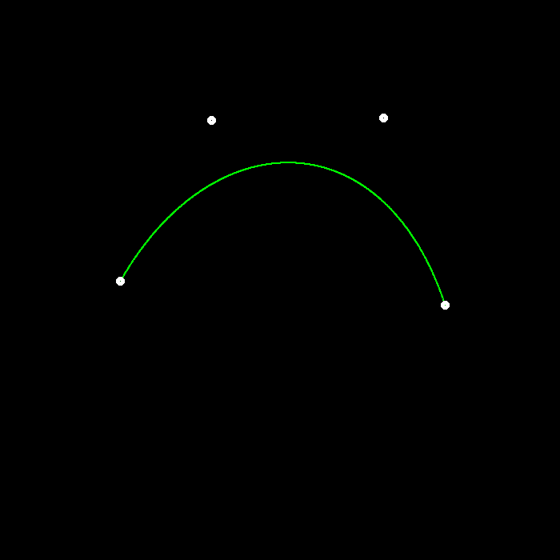

可以看到锯齿现象得到了明显改善。

### 总结

没有难度。

## Assignment5 光线追踪

说是光追，实际上要实现的部分并不多，整体以阅读框架为主。

按照作业要求所述，在 `main()` 中首先定义了场景 `scene`，并且调用 `add()` 方法加入各个物体，之后用 `Render.render()` 进行渲染。

这里的渲染方式很简单，对于屏幕空间中的每个像素，以相机为起点向可视空间中打出一条光线，找到光线的与第一个物体表面的交点，根据材质判断是否要进行反射/折射，并令光线进一步传播。如果光线最终能不遮挡地到达光源，那么这条光路就会被**有效渲染**，即将后续所有弹射点的着色值加到第一个交点上。

我们要实现两个函数，分别是确定打出光线的方向，以及判断光线和三角形的交点。

### 确定光线方向

因为有 MVP 变换，所以相机视为在 $xOy$ 平面上永远处于屏幕空间的中心，也就是 $(scene.width/2, scene.height/2)$。我们只要确定相机到屏幕的距离 $z$，就可以用像素中心坐标减去像素坐标，构造一个方向向量，`normalized()` 之后就是要求的光线方向了。

`scene` 中有一个参数 `fov`，表示相机在 $\mathbf{y}$ 方向的视角，有 $\displaystyle \tan(\text{fov}/2) = \frac{scene.height}{2z}$，这样就能算出 $z$ 了。

关于像素中心的坐标，这里有一个坑点在于，代码中的 $i, j$ 实际上是从左上角的像素开始，往右下角进行遍历的，而不是我们平常认知中的平面直角坐标系的遍历方式。在 $\mathbf{x}$ 方向上的分量很好求，就是 $i-scene.width/2+0.5$，但是 $\mathbf{y}$ 方向上的分量就不是 $j-scene.height/2+0.5$ 了，而是其相反数。

所以得到以下代码（稍作修改，更加可读）

```cpp
void Renderer::Render(const Scene& scene)
{
    static const int w = scene.width;
    static const int h = scene.height;

    std::vector<Vector3f> framebuffer(w * h);

    float z = h * 0.5 / std::tan(deg2rad(scene.fov * 0.5f));

    // Use this variable as the eye position to start your rays.
    Vector3f eye_pos(0);
    int m = 0;
    for (int j = 0; j < h; ++j)
    {
        float y = h * 0.5 - j - 0.5;
        for (int i = 0; i < w; ++i)
        {
            // generate primary ray direction
            float x = i - w * 0.5 + 0.5;
            Vector3f dir = normalize(Vector3f(x, y, -z));
            framebuffer[m++] = castRay(eye_pos, dir, scene, 0);
        }
        UpdateProgress(j / (float)h);
    }
    ...
}
```

> 注意 $z$ 要取负值，因为是往 $-\mathbf{z}$ 侧发出的光线。

### 与三角形的交点

用上课讲的 Möller–Trumbore 算法即可。

```cpp
bool rayTriangleIntersect(const Vector3f& v0, const Vector3f& v1, const Vector3f& v2, const Vector3f& orig,
                          const Vector3f& dir, float& tnear, float& u, float& v)
{
    // o + t * d = (1-alpha-beta) * v0 + alpha * v1 + beta * v2
    // t * (-d) + alpha * (v1 - v0) + beta * (v2 - v0) = o - v0
    // [-d, v1-v0, v2-v0] * [t, alpha, beta]^T = o-v0
    Vector3f X = -dir;
    Vector3f Y = v1-v0;
    Vector3f Z = v2-v0;
    Vector3f W = orig-v0;

    // Cramer's rule
    float detA = Determinant(X, Y, Z);
    float t = Determinant(W, Y, Z)/detA;
    float alpha = Determinant(X, W, Z)/detA;
    float beta = Determinant(X, Y, W)/detA;
    if (t <= 0.f || alpha < 0.f || beta < 0.f || 1-alpha-beta < 0.f) {
        return false;
    }

    tnear = t;
    // 这里参数意义不明，tnear 并不是全局最近，而仅仅是与三角形的交点的 t 值，用于在 trace() 里更新全局最近 t
    u = alpha;
    v = beta;
    return true;
}
```

> 注意判断交点是否在三角形内时不能用 $\leq0$，因为顶点也算在三角形内。

### 总结

CMakeLists 里的编译选项中有一个 `-fsanitize=undefined`，这会导致出现 `runtime error: xxx is outside the range of representable values of type 'char'` 的报错，将这个选项去掉就能 work 了。

输出结果如下：

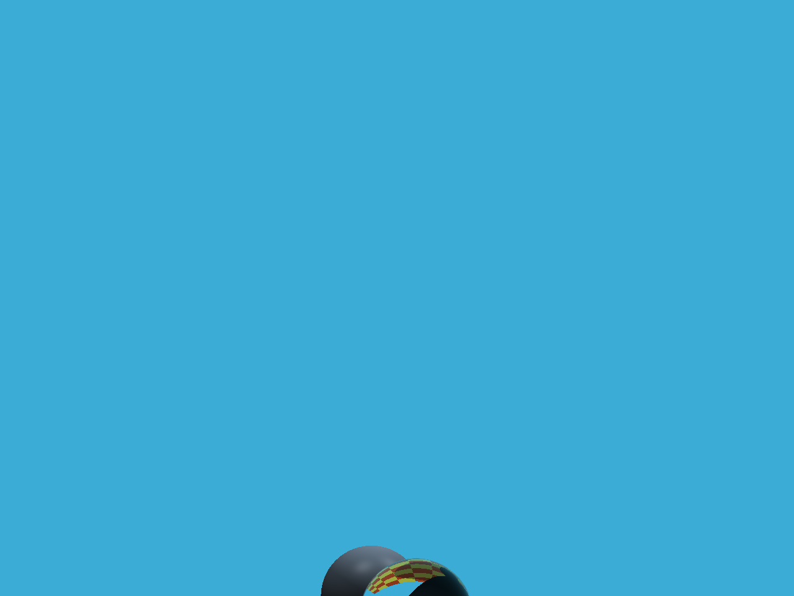

## Assignment6 BVH 加速结构

本次作业要求用 BVH 对光追进行加速。具体原理见课程笔记，简单来说其核心思想就是对物体进行划分，构建一棵 BVH-Tree，以二分的方式找到光线在场景中与物体的第一个交点，而不用遍历所有的物体，从而达到加速的效果。

### 判断 AABB 是否与光线相交

求出光线与三对平面的 $tmin, tmax$，然后判断这三个区间是否在 $\geq0$ 处有交集即可。

```cpp
inline bool Bounds3::IntersectP(const Ray& ray, const Vector3f& invDir,
                                const std::array<int, 3>& dirIsNeg) const
{
    Vector3f tmin = (pMin - ray.origin) * invDir;
    Vector3f tmax = (pMax - ray.origin) * invDir;
    if (dirIsNeg[0]) std::swap(tmin.x, tmax.x);
    if (dirIsNeg[1]) std::swap(tmin.y, tmax.y);
    if (dirIsNeg[2]) std::swap(tmin.z, tmax.z);

    float a = fmax(tmin.x, fmax(tmin.y, tmin.z));
    float b = fmin(tmax.x, fmin(tmax.y, tmax.z));

    return b >= a && b >= 0;
}
```

### 利用 BVH 加速求交

对于一个给定的 BVH 节点，我们首先判断光线是否与当前的 AABB 相交。如果不相交，那么这道光和所有的子节点必然不相交；反之，这个节点要么是叶子节点，要么光线和左右子节点都相交或者只和其中一个相交，需要分情况讨论：

- 如果是叶子节点，直接返回与物体的交点；
- 如果和左右子节点都相交，那么需要求出两个交点中最近的那个；
- 如果只和一个节点相交，那直接返回交点即可；

```cpp
Intersection BVHAccel::getIntersection(BVHBuildNode* node, const Ray& ray) const
{
    std::array<int, 3> dirIsNeg{ray.direction.x < 0, ray.direction.y < 0, ray.direction.z < 0};
    if (node->bounds.IntersectP(ray, ray.direction_inv, dirIsNeg)) {
        // 是叶子节点，直接判断是否与物体相交
        if (!node->left && !node->right) {
            return node->object->getIntersection(ray);
        }

        Intersection left  = getIntersection(node->left, ray);
        Intersection right  = getIntersection(node->right, ray);
        if (left.happened && right.happened) { // 都相交
            return left.distance < right.distance ? left : right;
        }
        if (left.happened) {
            return left;
        }
        if (right.happened) {
            return right;
        }
    }
    return {};
}
```

### 如何构建 BVH

首先将所有物体根据分布关系进行排序——在哪个轴上分布的最多就按哪个轴排。

```cpp
Bounds3 centroidBounds;
for (size_t i = 0; i < objects.size(); ++i)
    centroidBounds =
        Union(centroidBounds, objects[i]->getBounds().Centroid());
int dim = centroidBounds.maxExtent();
switch (dim) {
case 0:
    std::sort(objects.begin(), objects.end(), [](auto f1, auto f2) {
        return f1->getBounds().Centroid().x <
                f2->getBounds().Centroid().x;
    });
    break;
case 1:
    std::sort(objects.begin(), objects.end(), [](auto f1, auto f2) {
        return f1->getBounds().Centroid().y <
                f2->getBounds().Centroid().y;
    });
    break;
case 2:
    std::sort(objects.begin(), objects.end(), [](auto f1, auto f2) {
        return f1->getBounds().Centroid().z <
                f2->getBounds().Centroid().z;
    });
    break;
}
```

然后找到所有 `object` 中最中间的那个，划分成两个部分

```cpp
auto beginning = objects.begin();
auto middling = objects.begin() + objects.size()/2;
auto ending = objects.end();

auto leftshapes = std::vector<Object*>(beginning, middling);
auto rightshapes = std::vector<Object*>(middling, ending);
```

对这两部分分别进行构建

```cpp
node->left = recursiveBuild(leftshapes);
node->right = recursiveBuild(rightshapes);

node->bounds = Union(node->left->bounds, node->right->bounds);
```

对于特殊情况（只有一个或两个 `object`），则无需排序。

```cpp
if (objects.size() == 1) {
    // Create leaf _BVHBuildNode_
    node->bounds = objects[0]->getBounds();
    node->object = objects[0];
    node->left = nullptr;
    node->right = nullptr;
    return node;
}
else if (objects.size() == 2) {
    node->left = recursiveBuild(std::vector{objects[0]});
    node->right = recursiveBuild(std::vector{objects[1]});

    node->bounds = Union(node->left->bounds, node->right->bounds);
    return node;
}
```

### 总结

SAH 的优化效果并没有特别明显，就不掰扯了。

输出结果如下：

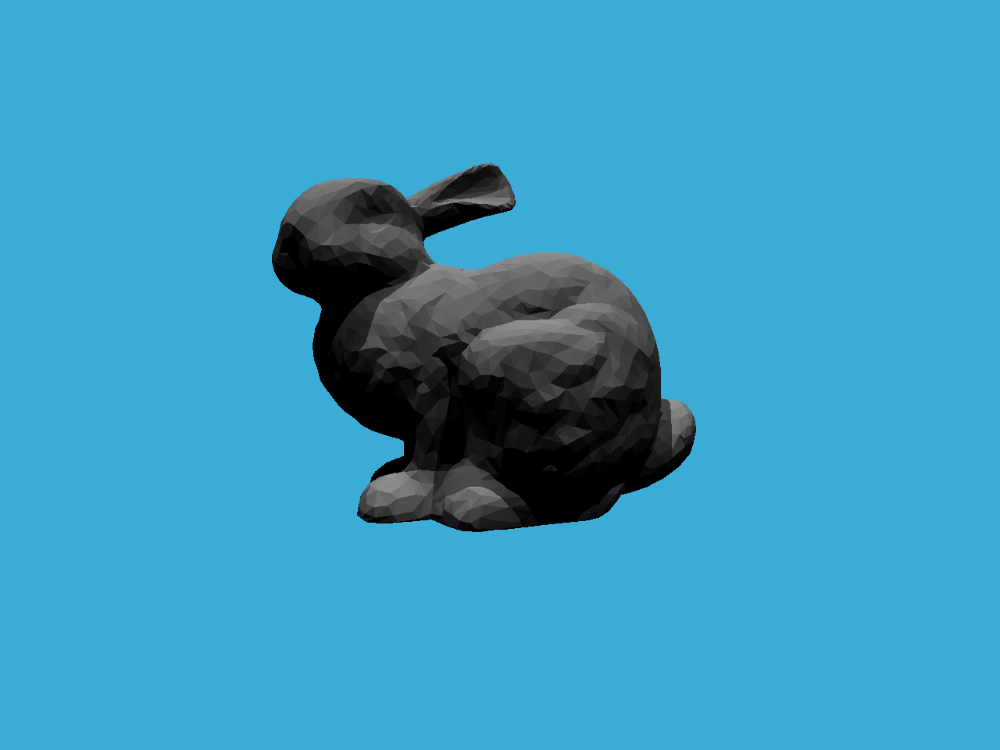

## Assignment7 Path Tracing

最难的一次，要求实现路径追踪。这次作业坑非常多，我将一一记录。

### 多线程

为了提高运行效率，我先做了多线程。

原本的代码是，按行优先顺序遍历像素点，调用 `castRay()` 等待返回的着色结果。

如果要做多线程版本，比如说设置 `n_thread` 个线程，那第 `i` 个线程负责 `rowId % n_thread = i` 的行即可。

```cpp
void Renderer::Render(const Scene& scene)
{
    ...
    const int n_worker = 16;
    std::vector<std::thread> worker;
    auto task = [&](int threadIndex) {
        for (int j = threadIndex; j < scene.height; j += n_worker) {
            for (int i = 0; i < scene.width; ++i) {
                // cast ray
            }
        }
    };
    for (int i = 0; i < n_worker; i++) {
        worker.emplace_back(std::bind(task, i));
    }
    for (auto&& w : worker) {
        w.join();
    }
    // save framebuffer to file
}
```

以及 `get_random_float()` 中的前三个变量都可以设为 `static`，经测试在 spp=256 的 case 下性能提高了 3 倍。

### 拷贝之前的代码

这里我们需要拷贝 `Bounds3::IntersectP()`、`BVHAccel::getIntersection()`、`Triangle::getIntersection`。

值得注意的是，在 `Bounds3::IntersectP()` 也就是判断光线和 AABB 是否相交的地方，需要用 `texit >= tenter`，而不是 `>`。这是因为作业 7 中几个物体的 AABB 可能就是一个二维平面而不是一个立方体，从而某一对平面的 `tenter = texit`。

如果用 `>`，最后结果就是一大片漆黑。

### 实现 castRay

当一束光线从相机出发打到可视空间中时，有三种情况：

1. 光线没有打到任何物体，此时观测结果为纯黑；
2. 光线打到自发光物体，此时直接返回其 color（在这里是 `material.emit`）；
3. 光线打到不发光物体，此时需要进行直接光照与间接光照的采样；

第一种情况很好实现，直接 `return` 即可，关键是第二种情况。

#### 直接光照

设光线打到物体的 $p$ 点。

对于直接光照的采样，框架为我们实现了 `sampleLight()` 方法，其原理是随机选择一个 `hasEmit() = true` 的物体（自发光物体，或者称其为光源），并在其表面上随机选择一点，返回该点的 `Intersection` 信息与 `pdf`。

有了这一信息后，还需要判断该光源与物体之间是否存在物体遮挡，判断方式就是以 $p$ 为起点，向光源打出一道光，判断击中的物体距离和物体与光源的距离是否相等。如果相等，则认为没有物体遮挡。

> 这里距离是浮点数类型，而判断浮点类型是否相等是无法做到的，课程里是通过两数之差的绝对值小于 `EPLSILON` 来判断相等。
>
> 这里 `EPSILON` 比数据精度小，导致即便没有物体遮挡也会在计算中判断错误，使得结果中出现黑色条纹。这里只需要将 `EPSILON` 从 `0.0001` 改为 `0.001` 即可。
>
> 当然，判断光线与 AABB 是否相交也可以用 `texit + EPSILON > tenter`

如果光源能直接照射到物体，那么我们就可以用公式计算直接光照项 `L_dir` 了。

这里如果改用光源向物体打出的光线进行遮挡判断会出现 `Intersection.distance = 0` 的错误，认为应该是光线与光源的 AABB 产生了交点，需要将起点进行偏移处理。为了方便还是采用从 $p$ 点出发的方法。

```cpp
Intersection light;
float pdf;
sampleLight(light, pdf);
float dis = (hitPoint - light.coords).norm();

Vector3f wi = (hitPoint - light.coords).normalized(); // 自发光物体打来的直接光照
Intersection block = intersect(Ray(hitPoint, -wi));   // 判断该光照是否被其它物体遮挡
if (block.happened && dis - block.distance < EPSILON) {
    float dis2 = dis*dis;
    Vector3f emit = light.emit;
    Vector3f eval = m->eval(wi, wo, N);
    float cosTheta = fmax(0.f, -dotProduct(wi, N));
    float cosThetaPrime = fmax(0.f, dotProduct(wi, light.normal));

    L_dir = emit * eval * cosTheta * cosThetaPrime / dis2 / pdf;
}
```

#### 间接光照

对于间接光照的计算，首先要用俄罗斯轮盘赌策略来判断是否需要继续递归。框架提供的随机数函数是 `get_random_float()`。如果进行了之前提到的优化，这一步的时间开销将会大大降低。

如果需要继续递归，那么就根据黎曼积分，在物体表面半球区域随机采样一个方向，框架提供的方法是 `Material::sample()`，根据入射方向与法线随机生成出射方向，然后根据公式计算间接光照项 `L_indir`。

```cpp
if (get_random_float() < RussianRoulette) {
    Vector3f sampleDir = m->sample(ray.direction, N).normalized();
    Vector3f wi = -sampleDir; // 其它物体打来的间接光照
    Vector3f eval = m->eval(wi, wo, N);
    Vector3f Li = castRay(Ray(hitPoint, sampleDir), depth + 1);
    float cosTheta = fmax(0.f, dotProduct(sampleDir, N));
    float pdf = m->pdf(wi, wo, N);

    L_indir = Li * eval * cosTheta / pdf / RussianRoulette;
}
```


这里要注意，间接光照不能由直接光源提供，否则能量就会不守恒——同一个光源提供了两次贡献。这里可以利用 `castRay()` 的 `depth` 参数，为 0 时表示由相机发出，可以接收光源的贡献；反之表示由场景中的物体进行间接光照采样时调用的。在 `Render::Render()` 中的调用设为 1，其它时候设为 0。

完整的函数如下：

```cpp
Vector3f Scene::castRay(const Ray &ray, int depth) const
{
    Intersection intersection = intersect(ray);
    if (!intersection.happened) {
        return {0.0, 0.0, 0.0};
    }

    Material *m = intersection.m;
    Vector3f hitPoint = intersection.coords;
    Vector3f N = intersection.normal;

    // 打到自发光物体
    // 如果是首次打到，说明是相机调用的 castRay()，直接返回其颜色；
    // 反之，说明是为了计算间接光照项，此时不能对自发光物体采样，返回空值；
    if (m->hasEmission()) {
        return depth == 0 ? m->getEmission() : Vector3f{0.0, 0.0, 0.0};
    }

    Vector3f L_dir;
    Vector3f L_indir;
    Vector3f wo = -ray.direction;

    {   // 直接光照
        Intersection light;
        float pdf;
        sampleLight(light, pdf);
        float dis = (hitPoint - light.coords).norm();

        Vector3f wi = (hitPoint - light.coords).normalized(); // 自发光物体打来的直接光照
        Intersection block = intersect(Ray(hitPoint, -wi));   // 判断该光照是否被其它物体遮挡
        if (block.happened && dis - block.distance < EPSILON) {
            float dis2 = dis*dis;
            Vector3f emit = light.emit;
            Vector3f eval = m->eval(wi, wo, N);
            float cosTheta = fmax(0.f, -dotProduct(wi, N));
            float cosThetaPrime = fmax(0.f, dotProduct(wi, light.normal));

            L_dir = emit * eval * cosTheta * cosThetaPrime / dis2 / pdf;
        }
    }
    {   // 间接光照
        if (get_random_float() < RussianRoulette) {
            Vector3f sampleDir = m->sample(ray.direction, N).normalized();
            Vector3f wi = -sampleDir;
            Vector3f eval = m->eval(wi, wo, N);
            Vector3f Li = castRay(Ray(hitPoint, sampleDir), depth + 1);
            float cosTheta = fmax(0.f, dotProduct(sampleDir, N));
            float pdf = m->pdf(wi, wo, N);

            L_indir = Li * eval * cosTheta / pdf / RussianRoulette;
        }
    }
    return L_dir + L_indir;
}
```

### 总结

微表面(Microfacet)部分我没做，因为看了半天公式依然不能理解，以后学有所成再来补上。

输出结果如下：

分辨率 960*1280，spp=256

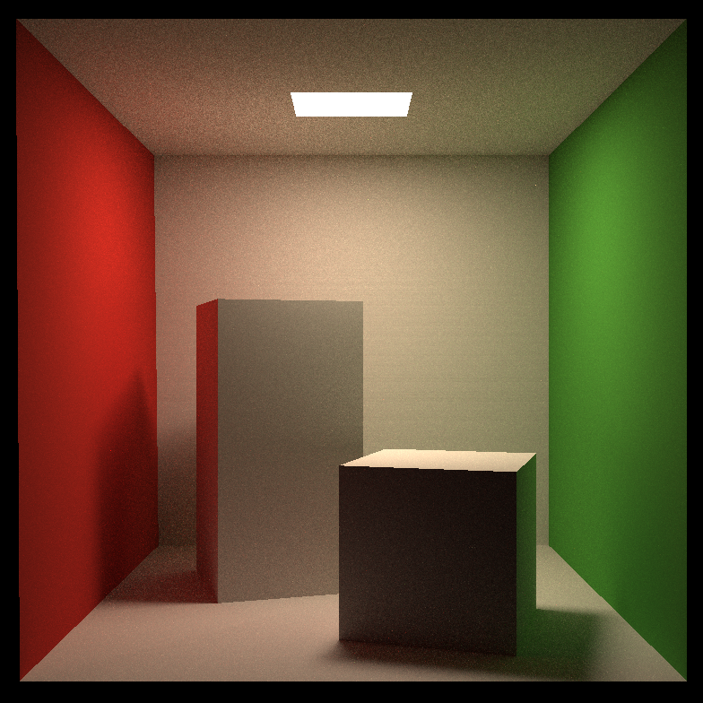