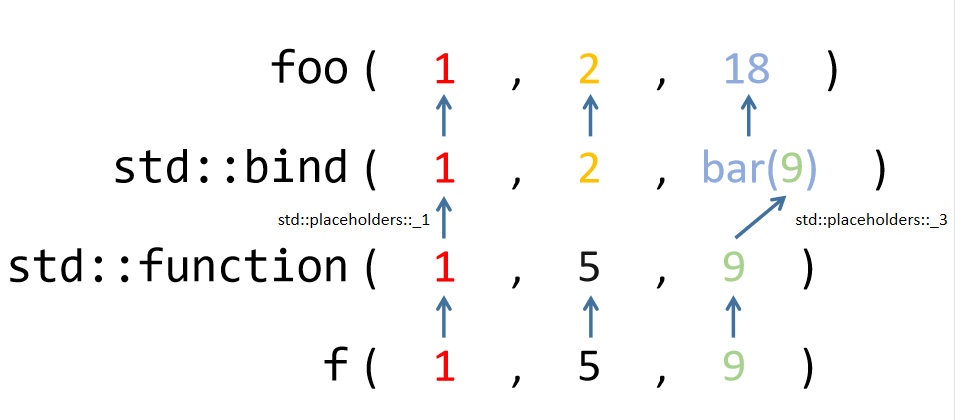

C++11 新增了若干使函数调用更加方便的特性。

<!--more-->

## lambda 表达式

lambda 表达式是**闭包类型**的**纯右值**变量，也可以称之为[**匿名函数**](https://www.google.com.hk/url?sa=t&rct=j&q=&esrc=s&source=web&cd=&ved=2ahUKEwijk6yxhNP8AhVY7XMBHQtYCeQQFnoECAwQAQ&url=https%3A%2F%2Fzh.wikipedia.org%2Fwiki%2F%25E5%258C%25BF%25E5%2590%258D%25E5%2587%25BD%25E6%2595%25B0&usg=AOvVaw0TjqSvvMd1ENd3yfCUYuz-)。其基本用法为：

```c++
auto func = [ 捕获 ] ( 参数列表 ) 可选说明符 -> 返回值类型 { 函数体 };
```

### 捕获

换句话说就是能够在函数体内使用捕获的变量。lambda 表达式支持以下捕获方式：

- **[]**：不捕获任何变量，但 lambda 表达式能够直接使用全局变量以及函数形参；

- **[=]**：**值捕获**，以拷贝方式捕获所有外部变量；

- **[&]**：**引用捕获**，以引用方式捕获所有外部变量；

- **[i]**：仅值捕获指定变量 `i`；

- **[=, &i]**：值捕获所有外部变量，以引用方式捕获指定变量 `i`；

- **[this]**：以引用方式捕获当前对象；

    > 事实上，若 lambda 表达式在类成员函数中，只要出现了捕获符，则隐式引用捕获当前类对象 `this`。

### 可选说明符

在 C++11 中，说明符只有 `mutable`。不加上该说明符，编译器会将值捕获的对象视为**常量**，只能调用其 const 成员函数；只有加上后，捕获对象的 const 限定消除，才能修改值捕获的对象，以及调用它们的非 const 成员函数。就像这样：

```c++
class A {
  public:
    int i = 0;
    void foo() {}
    void bar() const {}
};
A a;

auto f = [=]() {          // ERROR! 不能修改 const 对象 a 且调用非 const 成员函数 foo()
    ++a.i;
    a.foo();
    a.bar();
};
auto g = [=]() mutable {  // OK! 加入 mutable 后禁制解除
    ++a.i;
    a.foo();
    a.bar();
};
auto h = [&]() {          // OK! 引用捕获不受影响
    ++a.i;
    a.foo();
    a.bar();
};
```

### 延迟调用

在值捕获的情况下，除了会将捕获的对象视为 const，还会发生下面这种情况：

```c++
int a = 0;
auto f = [a]() { std::cout << a; };
a++;
f(); // 输出 0
```

从这个例子中不难发现，在捕获阶段 lambda 表达式的相关变量值就已经确定，尽管之后发生了修改，表达式内的变量也不会随之改变，这就是值捕获的**延迟特性**。如果希望值随着外部变化一起修改，则需要采用引用捕获。

### 悬垂引用

值捕获存在这样那样的注意事项，但引用捕获也并不是完美的。当引用捕获的对象在 lambda 表达式调用之前就已经因生命周期结束而被回收时，此时若在 lambda 表达式中使用该对象，那么会发生**未定义行为**。比如：

```c++
class A {
 public:
  int x = 0;
};
A* a = new A();
auto f = [&a]() { std::cout << a->x; };
delete a;

f();  // 不一定报错，但 Undefined behavior
```

lambda 并不能延长对象的生命周期，这是值得注意的。

### 思考

lambda 表达式作为一种变量存在，其又能通 `operator()` 来进行函数体的调用，不难发现，它与**仿函数**很像，即重载了 `operator()` 的类（**函数对象**），而该类的构造函数以及成员变量也由 lambda 表达式的捕获符来决定。

相比于传统函数，lambda 表达式胜在简洁方便，就地定义，让程序员更加灵活自由地在诸如 `std::sort` 等函数下编写自定义规则。由于不少语言都开始加入了匿名函数的特性，一定程度上揭示了未来编程的趋势。

## std::function

> 使用 `std::function` 需包含 `<functional>` 头文件。

`std::function` 是一个包装器，能够存储复制和调用任何**可调用对象**。函数原型为：

```c++
template< class R, class... Args >
class function<R(Args...)>;
```

其中 `R` 为返回值类型，`Args` 为参数包。

之所以新建这一个类，是为了起到“**类型消除**”的目的——将所有可调用对象的类型进行统一，从而方便编程。存储的可调用对象被称为 `std::function` 的**目标**。若 `std::function` 不含目标，则称它为**空**。对空实例的调用会抛出 `std::bad_function_call` 异常。

> 跟秦始皇统一六国差不多(bushi

### std::funtion::operator()

函数原型为：

```c++
R operator()( Args... args ) const;
```

等效于进行 `INVOKE<R>(f, std::forward<Args>(args)...) `，其中 `f` 是实例目标，相当于是将收到的参数包**转发**给目标可调用对象，实际操作依然为 `f(args)`。

### 可调用对象

先来说说什么是可调用对象。可调用对象简单来说就是给定合适的参数列表，其能够返回某个值。常见的可调用对象有以下几种：

- 函数/函数指针；
- lambda 表达式；
- 函数对象；
- 类成员函数/成员函数指针；
- 类非静态成员变量指针；
- `std::bind` 表达式；

### 使用方法

- 存储**函数**：

    ```c++
    void foo(int i) { std::cout << i; }
    std::function<void(int)> f;
    
    f = foo; // 存储 void(int) 类型的函数
    f(1); // output: 1
    // or
    f = &foo;
    f(1); // output: 1
    ```

- 存储**模板函数**：（后面类模板也是一样的）

    ```c++
    template<typename T>
    void foo(T i) { std::cout << i; }
    
    std::function<void(int)> f = foo<int>;
    f(2); // output: 2
    ```

- 存储 **lambda 表达式**：

    ```c++
    std::function<void(int)> f = [](int i) { std::cout << i; };
    f(3); // output: 3
    
    // 同时，可以利用其在 lambda 表达式中模拟递归
    auto factorial = [](int n) {
        std::function<int(int)> fac = [&](int n){ return (n < 2) ? 1 : n*fac(n-1); }; // 而 lambda 表达式 auto fac = [&](int n){...}; 无法用于递归
        return fac(n);
    };
    
    std::cout << factorial(4);   // output: 24
    ```

- 存储**函数对象**：

    ```c++
    struct foo {
      void operator()(int i) const { std::cout << i; }
    };
    
    std::function<void(int)> f = foo; // 必须是重载类型为 void operator() (int) 类型的函数对象
    f(4); // output: 4
    ```

- 存储**类成员函数**：

    ```c++
    class Foo {
     public:
      Foo(int num) : num_(num) {}
      void foobar(int i) const { std::cout << num_ + i; }
      int num_;
    };
    Foo foo(2);
    /*
     必须传入函数指针，视为 void(Foo::*)(int) 类型，
     否则会因为调用无实例的非静态成员函数而报错。
     由于成员函数通过一个名为 this 的额外隐式参数来访问调用它的那个对象，
     也就是第一个参数，
     故 const Foo& 必须为第一个形参类型，视为 this
     */
    std::function<void(const Foo&, int)> f = &Foo::foobar;
    f(foo, 3); // output: 5
    f(3, 3);   // output: 6  (隐式调用构造函数)
    ```

- 存储**类成员变量访问器**：

    ```c++
    class Foo {
     public:
      Foo(int num) : num_(num) {}
      int num_;
    };
    Foo foo(7);
    
    std::function<int(Foo const&)> h = &Foo::num_; // 理由同上
    std::cout << h(foo); // output: 7
    ```

- 存储 **std::bind 表达式**：（关于 `std::bind` 详情见下文）

    ```c++
    class Foo {
     public:
      Foo(int num) : num_(num) {}
      void foobar(int i) const { std::cout << num_ + i; }
      int num_;
    };
    Foo foo(4);
    
    std::function<void(const Foo&, int)> f;
    using std::placeholders::_1;
    
    f = std::bind( &Foo::foobar, foo, _1 );
    f(4);                        // output: 8
    // or
    f = std::bind( &Foo::foobar, &foo, _1 );
    f(5);                        // output: 9
    ```

### 思考

于是乎，如果希望某一函数能够接受一个可调用对象的形参，实际传参时再也不用纠结是传函数指针还是 lambda 表达式了，一个 `std::function` 统统搞定。

## std::bind

`std::bind` 将参数 `args` 绑定到可调用对象 `f` 以生成**转发**包装器，调用此包装器等价于调用 `f(args)`，之所以称其为转发器，是因为参数是被转发给目标函数再调用（其实就是当一个中介/路由器）。

乍一眼看上去这与 `std::function` 相性非常相似，事实上 `std::bind` 生成的返回值可以由 `std::function` 接纳存储，以便随时调用，就和上面示例的那样。

除此之外，`std::bind` 还可以将 m 参数的可调用对象转为 n 参数的可调用对象，绑定 m-n 个参数，剩下的未绑定参数被 `std::placeholders` 的占位符 `_1, _2, _3...` 所替换。

### 使用方法

先上例子：

```c++
void foo(int i, int j, int k) { std::cout << i + j + k; }
int bar(int i) { return i * 2; }

std::function<void(int, int, int)> f = std::bind(foo, std::placeholders::_1, 2, std::bind(bar, std::placeholders:: _3));

f(1, 5, 9); // output: 21  实际上调用了 foo(1, 2, bar(9)) 即 foo(1, 2, 18);
```

来解释一下这个例子：

`std::placeholders::_1` 对应了 `f()` 中的第一个参数，也就是 **1**。`std::placeholders::_3` 对应了 `f()` 中的第三个参数，也就是 **9**。而第二个参数 **5** 对应的占位符 `std::placeholders::_2` 由于并不在 `std::bind` 绑定的参数列表中，故无影响。

不难发现，`std::placeholders::_n` 会被实际传入的参数包中的第 n 个参数取代。但参数也不能乱传，还是要遵循可调用对象的实际情况，比如上面的 `foo` 需要 3 个参数，那么 `f` 就传 3 个，只不过这三个参数最终会被如何转发，就得看 `std::bind` 的规则（参数绑定情况）了。转发过程如下图所示：



对象 `f` 根据 `operator()` 收到的三个参数传回 `std::function` 类中，根据 `std::forward` 转发给目标可调用对象。由于存储的同样是一个转发器，故参数包会先发给 `std::bind`，其根据编写好的自定义规则经过处理后再次转发给其绑定的目标可调用对象 `foo`，完成最终函数调用。

> 内层的 `std::bind(bar, 9)` 会先转发给可调用对象 `bar`，获取返回值后再让外层转发。

## 总结

以上三种特性让用户进行函数调用时更灵活自由，极大的提高了编程效率。
